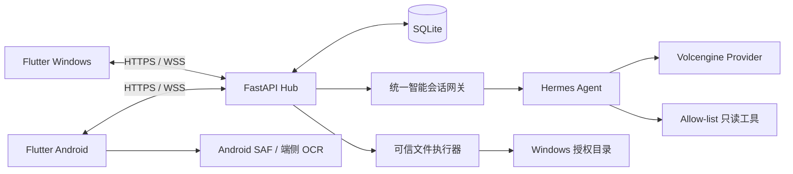

<div align="center">

# Data Steward

### 多设备数据管理智能管家

让分散在 Windows 与 Android 中的资料，从“被动存储”转向“主动服务”。

[](https://flutter.dev/)
[](https://www.python.org/)
[](https://fastapi.tiangolo.com/)
[](#已验证环境)
[](#hermes-agent-如何工作)

[核心能力](#核心能力) · [系统架构](#系统架构) · [快速开始](#快速开始) · [安全设计](#安全设计) · [项目文档](#项目文档)

</div>

---

## 项目简介

Data Steward 是一个本地优先的 Windows/Android 多设备资料管理 APP Demo。

用户可以直接使用自然语言提出需求：

- “查一下电脑授权目录里有多少张图片。”
- “帮我找文件名中包含训练营的资料。”
- “阅读当前课程资料，列出三个最重要的复习要点。”
- “参考我的整理习惯，整理当前资料。”
- “生成一份带来源的跨设备复习资料包。”

Hermes Agent 负责理解意图、拆分任务和选择受控工具；FastAPI Hub 负责设备认证、权限校验、状态持久化和可信执行。涉及移动文件或导出资料时，系统始终遵循：

> **建议 → 预览 → 用户确认 → 执行 → 可验证撤销**

项目来自互联网大厂实战训练营，最终在 **Windows 11 PC + 华为 Android 12 真机**上完成闭环验证。

## 为什么不是普通的 AI 聊天壳？

| 普通 AI 对话 | Data Steward |
|---|---|
| 只生成文字回复 | 查询真实授权目录并汇总多设备资料 |
| 模型直接决定行为 | 模型规划，Host 再校验权限、参数和快照 |
| 网络重试可能产生重复结果 | 幂等键、单调序号、游标回放和离线 Outbox |
| 无长期使用偏好 | 三次独立采纳形成候选习惯，批准后跨会话使用 |
| 写操作缺少保护 | Action Card 二次确认、状态恢复和安全撤销 |

## 产品预览

<table>
  <tr>
    <td align="center"><strong>安全配对</strong></td>
    <td align="center"><strong>智能会话</strong></td>
    <td align="center"><strong>跨会话记忆</strong></td>
  </tr>
  <tr>
    <td></td>
    <td></td>
    <td></td>
  </tr>
</table>

> 截图来自华为 Android 12 真人 Gate。部分截图保留阶段验收用语，最终产品界面已进一步优化。

## 核心能力

### 多设备安全连接

- 二维码配对、TLS 证书指纹 pinning 和双端 Human32 短码确认；
- Android Keystore 保存设备凭据，Windows DPAPI 保护本机 TLS 私钥；
- 按能力授权 `session.sync`、`files.read`、`catalog.sync`、`content.analyze`、`files.organize` 和 `knowledge.export`；
- 权限降级或设备撤销后，存量 WebSocket 连接立即失效。

### 可靠共享会话

- SQLite 持久事件流和会话内单调 sequence；
- 幂等提交，避免弱网重试造成重复消息或重复执行；
- REST 游标回放、WebSocket 实时同步和 Android 离线 Outbox；
- 网络不稳定时等待恢复，不进行循环重试。

### 跨设备资料目录

- Windows 和 Android 分别授权专用资料目录；
- Android 使用 SAF，不申请全盘存储权限；
- Hub 汇总双设备文件元数据、来源设备和目录版本；
- 文件删除、目录切换和版本升级会替换旧投影；
- “今日资料”按时间、文件名和内容线索生成可解释分组。

### 受控内容理解

- Windows 支持 TXT、Markdown、DOCX、PPTX 和文本型 PDF；
- 加密 PDF、异常压缩结构、外链、超限输入和提示注入 fail-closed；
- Android 对授权目录中的 JPG/PNG 进行端侧 OCR；
- 原图不上传，只同步有界、加密、版本绑定且可遗忘的文字投影；
- 可生成学习要点、复习顺序、项目简报和会议资料摘要。

### 智能整理与资料包

- Hermes 根据自然语言和真实已启用习惯生成 typed Action Card；
- 普通资料分组是虚拟视图，不会修改文件；
- 用户确认后，只移动 Windows 授权目录范围内的匹配文件；
- 不移动手机文件、不覆盖同名文件、不静默删除；
- 跨设备资料可预览后导出为带来源的 Markdown；
- 整理和导出均支持幂等、重启恢复和安全撤销。

### 自主学习与记忆

- 三次独立采纳形成候选习惯，必须由用户明确启用；
- 后续普通“整理/归档/分类”表达会查询真实启用习惯；
- 支持停用、遗忘和人工重新启用；
- Hub 暂时离线时，手机只展示身份与权限版本绑定的安全快照。

## 系统架构



| 层级 | 职责 |
|---|---|
| Flutter APP | 双端 UI、目录授权、会话、扫码、Action Card 和用户确认 |
| FastAPI Hub | 认证、权限、消息持久化、Catalog、Agent 调度与文件执行 |
| SQLite | 会话、消息、设备、权限、目录投影、操作记录和习惯状态 |
| Hermes Agent | 意图理解、多步规划和白名单工具选择 |
| Host 安全边界 | 参数、权限、目录、快照、输出校验以及写操作控制 |

## Hermes Agent 如何工作

Hermes 可以在有限预算内自主选择目录查询、文件搜索、资料聚类、内容摘要和记忆上下文等白名单工具，但被明确限制为：

- 无 Shell、无任意文件读写、无任意网络访问；
- 不直接执行文件移动或资料包导出；
- 工具参数、调用次数、总 deadline 和输出 schema 均由 Host 校验。

Agent 拥有“理解与规划”的主动权，真实数据操作仍由可信执行层和用户共同控制。

## 技术栈

| 领域 | 技术 |
|---|---|
| 跨端客户端 | Flutter、Dart、Android Kotlin |
| 本地 Hub | Python 3.12、FastAPI、Uvicorn |
| 数据与通信 | SQLite、REST、WebSocket |
| 智能体 | Hermes Agent 0.18.2、Volcengine Provider |
| Windows 安全 | TLS、DPAPI、严格 DACL、证书指纹 pinning |
| Android 安全 | SAF、Keystore、最小权限、端侧 OCR |
| 工程质量 | unittest、Flutter test、真机 Gate、SHA-256 交付审计 |

## 仓库结构

```text
Data-Steward/
├─ apps/steward_app/          # Flutter Windows / Android APP
├─ services/steward_hub/      # FastAPI Hub、SQLite 与安全执行器
├─ agents/hermes_runtime/     # Hermes 适配、Provider Gate 与工具桥
├─ docs/
│  ├─ protocol/               # 会话、配对、Catalog、记忆等协议
│  ├─ spikes/                 # 各阶段设计与验证结论
│  ├─ cursor-tasks/           # Plan—执行—Review 任务记录
│  └─ evidence/               # 脱敏真机与验收证据
└─ tool/                      # 构建、验收和交付脚本
```

## 快速开始

### 环境要求

- Windows 11 64 位；
- Flutter stable、Python 3.12.x；
- Visual Studio 2022：Desktop development with C++；
- Android SDK/ADB；
- 手机与电脑位于同一可信 Wi-Fi，Windows 网络为“专用”。

### 1. 准备 Python 环境

```powershell
py -3.12 -m venv .\services\steward_hub\.venv
& '.\services\steward_hub\.venv\Scripts\python.exe' -m pip install `
  -r '.\services\steward_hub\requirements.lock'

py -3.12 -m venv .\agents\hermes_runtime\.venv
& '.\agents\hermes_runtime\.venv\Scripts\python.exe' -m pip install `
  -r '.\agents\hermes_runtime\requirements.lock'
```

### 2. 构建 Windows APP

```powershell
Push-Location .\apps\steward_app
flutter pub get
flutter analyze
flutter test
flutter build windows --debug
Pop-Location
```

### 3. 生成本机 TLS 身份

```powershell
& '.\services\steward_hub\.venv\Scripts\python.exe' `
  '.\services\steward_hub\tool\provision_permanent_identity.py'
```

身份只生成在 Windows CurrentUser 的 LocalAppData Known Folder，不进入 Git。

### 4. 启动完整 Demo

不使用云模型：

```powershell
.\apps\steward_app\tool\start_c3_windows_demo.ps1
```

使用 Volcengine + Hermes：

```powershell
$env:ARK_API_KEY = [System.Net.NetworkCredential]::new(
  '',
  (Read-Host '请输入 ARK_API_KEY' -AsSecureString)
).Password
$model = Read-Host '请输入 Volcengine endpoint ID'

.\apps\steward_app\tool\start_c3_windows_demo.ps1 `
  -HermesProvider volcengine `
  -HermesModel $model
```

完整部署、Android 安装和故障排查请阅读[安装与使用指南](docs/INSTALL_AND_USER_GUIDE.md)。

## 推荐演示流程

1. 启动 Windows APP，手机恢复可信身份或完成安全配对；
2. 双端授权专用资料目录；
3. 用手机查询电脑图片数量或文件名；
4. 请求 Hermes 生成跨设备复习要点；
5. 发送自然语言整理需求，展示真实习惯与 Action Card；
6. 预览、确认执行并演示安全撤销；
7. 生成跨设备资料包并导出 Markdown；
8. 打开记忆中心，展示习惯状态与离线安全快照。

建议始终使用非敏感 fixture 演示。

## 安全设计

- **最小授权**：只访问用户明确选择的目录和能力；
- **身份绑定**：TLS 指纹、短码确认和设备凭据共同建立信任；
- **读写分离**：Hermes 使用只读工具，写操作由 Host 执行；
- **显式确认**：文件移动和导出必须经过预览与用户确认；
- **Fail-closed**：权限、快照、文件摘要或协议异常时停止操作；
- **可恢复**：使用幂等、游标、Outbox 和持久状态应对弱网与重启；
- **不提交秘密**：API Key、TLS 私钥、数据库、用户资料和虚拟环境均被排除。

## 已验证环境

- Windows 11 64 位；
- Flutter 3.44.6 / Dart 3.12.2；
- Python 3.12.6；
- 华为 Android 12 / API 31 / arm64-v8a；
- Windows 与 Android Debug/Release 构建；
- 自动化测试、华为真机 Gate、重启/断线恢复和最终交付审计。

## 当前边界

当前 Demo 尚未覆盖 iOS/Pad 真机、录音转写、扫描 PDF OCR、向量数据库、手机端真实文件移动、日历/待办写入、跨设备写入 Saga 和自包含 Windows 安装器。

Android APK 使用训练营 Demo 签名，不用于应用商店生产发布。WLAN 自动发现受网络环境影响，并保留服务码刷新兜底。

## 项目文档

- [项目分析与立项结论](docs/PROJECT_ANALYSIS.md)
- [产品需求文档](docs/PRD.md)
- [技术架构设计](docs/ARCHITECTURE.md)
- [官方要求与能力追踪](docs/REQUIREMENTS_TRACEABILITY.md)
- [安装与使用指南](docs/INSTALL_AND_USER_GUIDE.md)
- [最终交付说明](docs/DELIVERY_PACKAGE.md)
- [协议文档](docs/protocol/)

> 公开仓库仅保留产品源码、协议和复现所需文档；包含本机环境信息的完整执行审计与内部任务记录保存在私有工程仓库中。

## 项目说明

本仓库用于训练营项目展示、工程复盘与求职作品集。仓库目前未附开源许可证，公开可见不代表授予复制、修改或再分发权利。

> 只声明已经通过自动测试、Windows 验收或华为真机 Gate 的能力；规划文档中的未来目标不代表已经实现。
