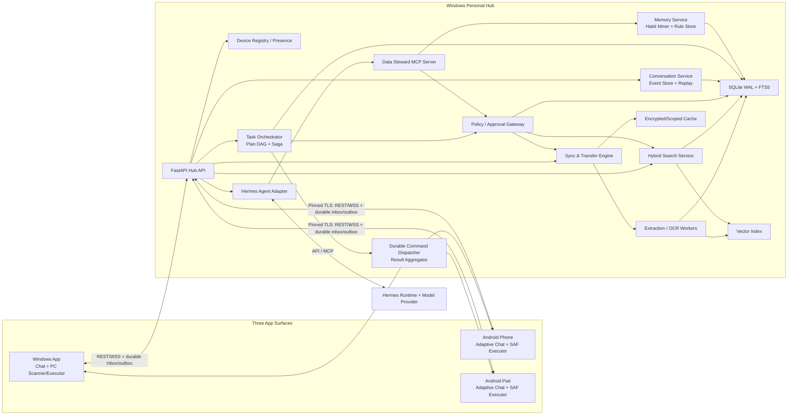
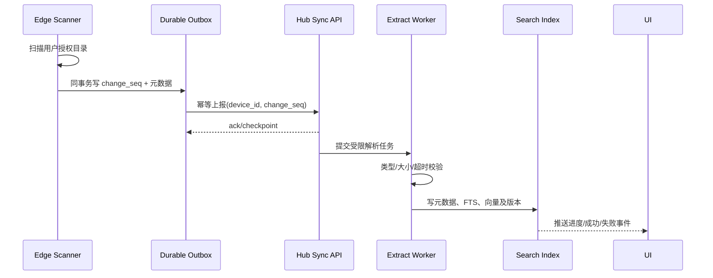
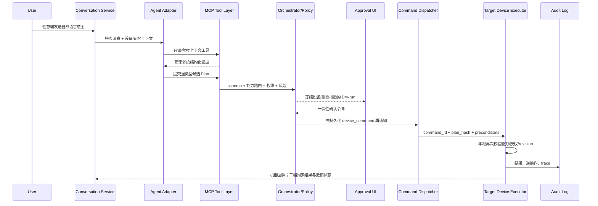
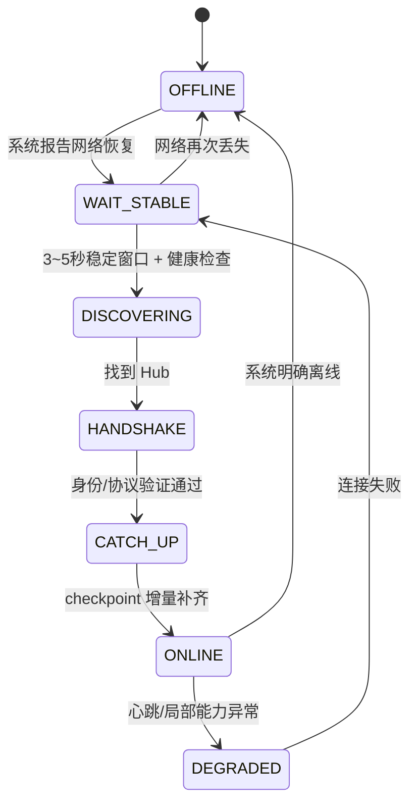

# 技术架构设计

> 状态：MVP Baseline v2.0  
> 更新日期：2026-07-10  
> 架构范围：Windows 本地 Hub + PC/Android 手机/Android Pad 三端共享工作空间 + 可替换 Agent Runtime

## 1. 架构目标

本架构同时解决七个问题：

1. 多设备文件如何被统一发现和检索；
2. PC、手机、Pad 如何共享同一会话、计划和执行状态；
3. Agent 如何把意图编译为目标设备明确、可恢复的任务图；
4. 原文件不集中上传时如何保持来源与可用状态；
5. Agent 如何真实执行但不越权操作个人数据；
6. 系统如何自主发现习惯、跨会话记忆且支持纠正/遗忘；
7. 设备离线、网络抖动和重复消息下如何可靠恢复并交付可安装 APP。

架构原则：

- **Local-first**：PC 是单用户本地 Hub，核心路径不依赖公网。
- **One logical agent**：三端连接一个会话/编排控制面，不让三个自治 Agent 互相制造冲突。
- **Persist before notify**：会话事件和设备命令先持久化，再通过 WebSocket 通知；实时通道不是事实真源。
- **Metadata-first**：元数据和派生索引先同步，原始文件按需传输。
- **Single source of truth**：源设备上的 revision 是文件原件真源，Hub 维护统一目录和关系。
- **Agent plans, policy decides**：模型只生成候选计划，确定性策略与执行器掌握权限。
- **Non-destructive by default**：智能归档默认创建虚拟集合，不直接搬动原文件。
- **Verified execution**：每个步骤绑定实际设备、授权根和前置版本，成功必须有机器可核验回执。
- **Product-owned memory**：记忆由本项目管理来源、作用域、版本和遗忘，Agent 框架不是业务真源。
- **Observable failure**：离线、陈旧索引、权限不足和解析失败都成为显式状态。
- **Replaceable intelligence**：设备、索引、策略不依赖具体 LLM/Agent 框架。

## 2. 总体架构



### 2.1 六个工程边界

| 边界 | 责任 | 不承担 |
|---|---|---|
| 体验/会话面 | 三端共享消息、计划卡、设备步骤、确认、结果和记忆建议 | 让每个终端维护独立事实 |
| 设备数据面 | 授权扫描、变更日志、文件提供、命令 inbox、受控执行、结果 outbox | 意图理解、信任 Hub 可绕过本地权限 |
| Hub 服务面 | 会话事件、设备注册、同步、统一目录、索引、命令和结果聚合 | 让模型直接读写磁盘 |
| Agent 控制面 | 意图理解、候选计划、工具选择和解释 | 冻结设备目标、权限裁决、任意系统命令 |
| 编排/执行面 | Plan DAG、能力路由、Saga、路径边界、确认、幂等、版本校验、审计/撤销 | 依赖 Prompt 保证安全或伪造全局事务 |
| 学习/记忆面 | 行为证据、候选习惯、批准规则、跨会话检索、纠正/遗忘 | 把框架 memory 或文件向量库冒充产品学习 |

## 3. 技术栈基线

| 层 | 基线选型 | 原因与兜底 |
|---|---|---|
| PC/Android UI | Flutter adaptive layout + Riverpod + go_router + Dio + WebSocket | 一套 UI/事件投影覆盖 Windows、手机和 Pad；三端显示同一结构化会话 |
| 端侧持久化 | Drift/SQLite：client outbox、command inbox、event cursor、result cache | WebSocket 丢失或进程重启后仍可补消息/命令且幂等执行 |
| Android 能力 | SAF、MediaStore、Keystore、前台/WorkManager Spike | 遵守 scoped storage；手机/Pad 共用 APK；即时执行需真机验证后台限制 |
| Hub | Python 3.11+、FastAPI、Pydantic、SQLAlchemy/Alembic | 文档解析/AI 生态完整，OpenAPI 易生成客户端 |
| 主数据库 | SQLite WAL + FTS5 | 嵌入式、易安装；适合个人单 Hub |
| 中文词法 | 一致的预分词或 trigram 策略 | 默认英文 tokenizer 不足；必须用黄金集验证 |
| 向量检索 | `sqlite-vec` 通过 Windows 打包 Spike 后启用 | 若失败，5 万 chunk 内使用 NumPy 暴力余弦或 hnswlib |
| 嵌入模型 | 小型中文 embedding 的 ONNX 量化版本 | 本地隐私与可离线；模型 ID/版本写入索引 |
| 文档提取 | PyMuPDF、python-docx、python-pptx、Pillow | 每类解析器独立超时、大小上限和失败隔离 |
| OCR/ASR | RapidOCR/PaddleOCR 最小图片 OCR；faster-whisper（增强阶段） | Showcase 的手机截图/白板进入 P0；音视频理解不阻塞 MVP |
| Agent | Hermes Agent Adapter + 自研 MCP/Plan/Policy Gateway | 与 Python/MCP 契合；固定版本；记忆由项目自有服务提供，保留确定性降级 |
| 编排/任务 | SQLite 持久 Plan DAG + 单进程调度器 + Saga | MVP 不引入 Redis/Kafka/Temporal/Celery，设备命令先落库后通知 |
| 模型 | OpenAI-compatible Provider Adapter | 可切本地/云端；云端只发送最小片段并显式披露 |
| 设备通信 | mDNS + QR 兜底、HTTPS REST、WebSocket、分块传输 | 可调试、跨端成熟；MVP 不引入 gRPC/BLE |
| 安全 | TLS pinning、一次性配对令牌、OS Keystore、能力令牌 | 使用成熟库，不自行设计密码算法 |
| 测试 | pytest、Flutter integration_test、Hypothesis、Toxiproxy、k6 | 覆盖路径安全、弱网、重放和性能 |
| 打包 | Flutter Windows + Python sidecar（PyInstaller/Nuitka Spike）+ 单一 Android APK | 同一 APK 安装到手机/Pad；最终用户无需安装 Python/Docker |

所有依赖在 Phase 0 Spike 通过后锁定精确版本与哈希；训练营中期不跟随上游 `latest` 升级。

## 4. Agent Runtime 决策

### 4.1 基线：Hermes Agent，可替换适配

选择 Hermes 作为 MVP 候选而非把它嵌入业务核心，原因是：

- 原生支持 Windows，技术栈以 Python 为主；
- 支持 MCP，便于将本项目能力暴露为窄而强类型的工具；
- 其持久记忆/技能和写入审批机制可作为实现参考；
- 可通过 API/适配层连接自定义 UI。

但以下能力必须属于本项目，而不是 Hermes：共享会话事件、设备身份、任务图/命令、同步、统一目录、索引、行为证据、长期记忆真源、策略、文件事务、审计和撤销。Hermes 只消费经过授权召回的记忆片段；Agent Runtime 故障时，上述能力仍可工作。

### 4.2 OpenClaw 的位置

OpenClaw 的 Gateway、WebSocket 节点、配对、幂等和安全模型是重要设计参考，也可以在后续实现第二个 Agent Adapter；MVP 不同时集成两个完整 Runtime，以免重复解决会话、工具和配置问题。

### 4.3 2 天决策门（Framework Gate）

Hermes 只有同时满足以下条件才进入关键路径：

- Windows 干净环境可固定版本启动；
- 4 类黄金意图各连续运行 20 次，工具链成功率 ≥ 95%；
- 能稳定调用本地 MCP 工具并输出可验证的结构化参数；
- 取消、超时和 trace 可传回 UI；
- 无模型时可切换确定性路由调用同一工具 schema。

任何一项不满足，则 Agent Adapter 切到直接 function-calling/确定性状态机；产品、MCP 和策略层不变。该降级不是伪装成 Agent，而是保证演示主路径不被框架故障拖垮。

参考：

- Hermes 架构：<https://hermes-agent.nousresearch.com/docs/developer-guide/architecture>
- Hermes MCP：<https://hermes-agent.nousresearch.com/docs/user-guide/features/mcp>
- OpenClaw Gateway：<https://docs.openclaw.ai/concepts/architecture>

## 5. 核心数据模型

不使用“绝对路径”作为逻辑文件身份。一个逻辑资产可以有多个设备位置和多个版本。

| 实体 | 核心字段 | 说明 |
|---|---|---|
| `conversation` | id, title, next_seq, active_turn_id, version | 三端共享会话真源 |
| `conversation_event` | event_id, conversation_id, seq, type, actor_device_id, causation_id, payload | 不可变、可重放业务事件 |
| `message` | id, client_message_id, conversation_id, seq, role, content_blocks | 消息幂等与结构化卡片 |
| `agent_turn` | id, conversation_id, lease, status, cancel_requested | 同一会话最多一个活跃回合 |
| `device` | id, public_key, name, platform, capabilities, state, last_seen | 配对设备与能力 |
| `authorization_root` | device_id, uri/path, permission, created_at, revoked_at | 用户授权边界 |
| `asset` | id, display_name, media_type, logical_hash | 逻辑资产 |
| `locator` | asset_id, device_id, uri/path, availability | 资产在设备上的位置 |
| `revision` | id, asset_id, size, mtime, quick_fingerprint, blake3, status | 不覆盖旧版本 |
| `document_chunk` | revision_id, ordinal, text, page/timestamp, extractor_version | 可追溯文本片段 |
| `embedding` | chunk_id, model_id, model_version, vector | 支持重建/版本迁移 |
| `change_event` | device_id, change_seq, type, payload_hash, acked_at | 增量同步与幂等 |
| `transfer_session` | id, revision_id, chunk_bitmap, state, final_hash | 断点传输 |
| `collection` | id, name, goal, created_by | 虚拟任务包 |
| `collection_item` | collection_id, asset_id/revision_id, rationale | 集合证据 |
| `plan / plan_step / step_dependency` | operation, resolved_device_id, authorization_root_id, preconditions, risk, timeout, failure_policy | 目标被冻结的任务 DAG |
| `execution_run / step_run` | plan_id, state, lease, attempt, receipt | Saga 与步骤状态 |
| `device_command / command_result` | command_id, device_id, idempotency_key, expires_at, result_hash | 设备 inbox/outbox 与精确回执 |
| `approval` | plan_hash, actor_device_id, scope, expires_at, consumed_at | 一次性确认 |
| `generated_artifact` | content_hash, format, source_seq_from/to | 会话记录/报告等确定性产物 |
| `behavior_event` | type, device_id, asset_ids, decision, occurred_at | 习惯学习证据 |
| `classification / feedback` | asset_id, category_id, confidence, source, correction | 分类与纠正闭环 |
| `rule_proposal / rule_evidence` | trigger, conditions, action, support, confidence, status | 自动发现、待审批规则 |
| `memory_item` | type, scope, value, evidence_ids, confidence, sensitivity, status, version, expires_at | 产品自有跨会话记忆 |
| `action_event` | action_id, request_id, result, inverse, trace_id | 审计与撤销 |

同一内容出现在多台设备时，以完整内容哈希关联为同一逻辑资产，但始终保留所有 locator 和 revision，不能为了“去重”静默删除副本。

## 6. 核心数据流

### 6.1 三端共享会话与事件回放

三端看到的不是三个独立聊天记录，而是 Hub 中同一 `conversation` 的投影。客户端发送消息携带 `client_message_id`，Hub 唯一约束去重、事务内写消息/事件并分配递增 `conversation_seq`，随后再通过 WebSocket 通知所有在线端。

```json
{
  "protocol_version": 1,
  "event_id": "uuid",
  "event_type": "execution.step.succeeded",
  "conversation_id": "uuid",
  "conversation_seq": 42,
  "actor_device_id": "phone-id",
  "causation_id": "message-or-command-id",
  "correlation_id": "trace-id",
  "occurred_at": "RFC3339",
  "payload": {}
}
```

持久事件至少包括：

- `conversation.message.accepted`
- `agent.turn.started/completed/failed/cancelled`
- `plan.drafted/validated`
- `approval.required/granted/expired`
- `execution.step.queued/running/succeeded/failed`
- `execution.completed/partial/compensated`
- `artifact.created/materialized`
- `classification.corrected`
- `memory.suggestion.created/accepted/rejected`

LLM token 增量可以是非持久流事件并携带 `turn_stream_seq`；最终 Agent 消息、计划和执行状态必须持久化。客户端按 `event_id` 幂等应用，重连携带 `last_conversation_seq` 回放缺口；缺口过大则获取 snapshot + 后续事件。语义是“至少一次投递 + 幂等消费”，不宣称网络 exactly-once。

MVP 每个会话最多一个活跃 Agent Turn；其他输入排队，或由用户显式取消当前回合。这样三端不会同时触发互相交错的两套文件计划。

### 6.2 建库与增量索引



MVP 为降低移动端负担，可在用户授权后将手机文件临时流式送到 PC 解析；解析完成立即清理临时原件，只保留用户允许的文本、向量和缩略图。后续再把 OCR/embedding 下沉到端侧。UI 必须如实说明当前处理位置。

### 6.3 跨端混合检索

1. 解析显式过滤：设备、时间、文件类型、项目/课程；“当前有几个文件”等精确事实先触发目标范围即时 refresh，不能用陈旧索引近似回答；
2. 并行执行 FTS5/BM25、向量相似度和元数据过滤；
3. 使用 RRF 融合，必要时只对 Top 20 轻量重排；
4. 返回文件名、命中片段、页码/时间戳、设备、路径、在线状态和索引新鲜度；
5. 打开时按“本地缓存 → 在线源设备按需取回 → 离线提示/等待”处理。

每个结论必须能回到 `device → locator → revision → chunk`。没有证据时输出“不确定/缺失”，不能由模型补齐事实。

### 6.4 Agent 计划、设备路由与行动闭环



领域工具保持窄而明确：

- `search_assets`
- `count_assets`
- `get_asset_context`
- `summarize_assets`
- `get_device_status`
- `fetch_asset`
- `propose_collection`
- `propose_archive`
- `validate_plan`
- `apply_plan`
- `undo_action`
- `export_conversation`
- `write_note`
- `propose_rule`
- `save_rule`

下沉到 Device Executor 的原语进一步收窄为 `refresh_scope、count_scope、stat/read_asset、create_directory、move_asset、materialize_artifact、restore/undo`。不暴露任意路径读写、Shell、脚本执行或通用“run command”工具。

### 6.5 多设备 Saga 与精确回执

Agent 可以表达“所有 Android 设备”或“PC 桌面”，但 Plan 进入审批前，Plan Compiler 必须把选择器解析并冻结为具体 `device_id + authorization_root_id + capability snapshot`。每个步骤包含：

```text
step_id / operation / resolved_device_id / authorization_root_id
asset|revision|artifact reference / dependencies / preconditions
risk / timeout / retry policy / failure policy / compensation
expected receipt schema
```

设备命令状态：

```text
PENDING → DISPATCHED → ACKED → RUNNING
        → SUCCEEDED | FAILED | EXPIRED | CANCELLED
```

设备对 `(device_id, command_id)` 唯一去重并缓存终态结果。PC 自身也注册为一个 device，并使用与 Android 相同的 Executor 合同。读步骤可有限并行，单设备写步骤串行；Hub 重启后回收过期 lease 并查询设备终态。

跨设备无法提供真正的原子提交，因此 MVP 使用 Saga：每个设备独立回执，整体状态为 `succeeded / partial / failed / cancelled`。例如“把交互记录写入手机和 Pad”先冻结会话序号范围并生成同一个 `generated_artifact`，再并行 materialize；两端写临时文件、校验 content hash 后原子提交。单端失败时显示 partial，恢复后以同一 command ID 续做，不重复生成文件。

成功回执至少包含实际 `device_id、authorization_root_id、revision/hash、影响文件数/字节数、开始/结束时间、结果 hash、inverse/undo 状态`。Agent 自述“已完成”不构成成功。

### 6.6 习惯进化与分层记忆

记忆真源属于本项目，不使用 Hermes 内部 memory 或文件向量索引替代。分层如下：

| 层 | 内容 | 使用方式 |
|---|---|---|
| Working | 当前回合目标、证据和计划 | 会话内直接使用 |
| Conversation | 共享消息、摘要及序号范围 | 跨端回放和会话搜索 |
| Episodic | 搜索、打开、整理、纠正、接受/拒绝和结果事件 | 按相关性/时间召回 |
| Semantic Preference | 分类、命名、目标目录、时间偏好 | 命中时注入并显示来源 |
| Procedural Rule | 用户批准的受控任务模板 | 仍经过能力/策略/确认 |

采用事件 → 候选规则 → 用户审批 → 跨会话检索，而不是黑盒在线训练：

1. 记录已获授权的搜索、打开、计划接受/修改/拒绝和规则命中事件；
2. 达到最小证据阈值后生成 `trigger + conditions + action` 候选；
3. 显示支持样本、建议理由、数据范围和确认级别；
4. 用户接受后版本化保存到 `memory_item/rule`，Hermes 只接收检索到的最小片段；
5. 新会话或另一设备命中时展示“使用的记忆 + 来源事件”；
6. 规则可暂停、编辑、删除，下一轮不得继续使用旧版本，历史命中可审计。

例如：连续三次把训练营截图放入“项目/阶段/截图”后，主动建议该规则；用户批准后，从 Pad 新会话发出“按我的习惯整理”能引用该规则。完整文件原文、令牌和未经授权敏感内容不得写入长期记忆，AI 不得自行创建可绕过策略的 Skill。

## 7. 设备发现、配对与通信

### 7.1 发现顺序

1. mDNS/Bonjour：`_datasteward._tcp.local`；
2. PC 二维码：Hub 地址、协议版本、证书指纹、短时一次性 token；
3. 手动 IP + 配对码兜底。

MVP 不把 BLE 作为依赖，避免蓝牙权限与 Windows 适配吞噬主线时间。

### 7.2 配对流程

- Hub 首次启动使用成熟库生成设备身份与本地 TLS 证书；
- 二维码携带短时高熵 token 和证书指纹，不携带长期密钥；
- 手机/Pad 固定证书指纹，双方显示相同短验证码供用户核对；
- 成功后签发能力受限的设备凭证，存入 Windows Credential Manager / Android Keystore；
- 设备身份/能力变更需要重新配对，PC 可立即撤销凭证。

MVP 不声称“自研端到端加密协议”。若未来加入公网中继，再采用经过审计的 PAKE/Noise 类方案。

### 7.3 协议

- REST/JSON：会话回放、设备、授权、资产、同步、计划和命令控制；
- WebSocket：新事件通知、presence、进度和 Agent token 流；有副作用命令和最终状态不以 WebSocket 内存消息为真源；
- HTTPS 分块接口：按需文件传输与断点续传；
- OpenAPI：生成 Flutter 客户端，所有消息含 `protocol_version` 和能力协商；
- 副作用请求必须含 `request_id/idempotency_key`。
- 每个 Edge 持久化 client outbox、command inbox、event cursor 和 command result；漏掉通知时主动拉取待执行命令。

## 8. 同步、一致性与大文件

### 8.1 同步模式

- `INDEX_ONLY`：元数据 + 派生文本/向量，原件留端（默认）；
- `SMART_CACHE`：用户指定或高频资产缓存在 Hub（P1）；
- `FULL_BACKUP`：完整备份（P2，不进入训练营 MVP）。

### 8.2 最终一致性策略

- 每台设备维护单调递增的 `change_seq`；
- 每个共享会话由 Hub 维护单调递增 `conversation_seq`，三端仅保存投影与游标；
- outbox 与本地状态同事务写入，Hub 按 `(device_id, change_seq)` 去重；
- `device_command` 必须持久化后再通知，设备按 command ID 幂等执行并持久化回执；
- revision 不被原地覆盖；删除使用 tombstone，防止旧设备上线后复活记录；
- 写计划包含 revision/hash 前置条件，执行时变化则停止并提示冲突；
- 虚拟标签/集合可合并；物理移动、覆盖、删除不自动冲突合并。

### 8.3 断点传输

- 建议 4 MiB 分块，每块校验，最后做 BLAKE3 完整校验；
- chunk bitmap 与会话状态持久化；
- 先写临时文件，校验完成后原子重命名；
- 单 Android 设备传输并发 2、PC 并发 4 作为初始值，实测调整；
- 恢复时最多重传未确认块，不从头开始。

## 9. 网络抖动与重连

状态机：



重试分类：

- 临时错误（超时、连接复位、临时不可用）：`1/2/4/8/16/30s + full jitter`，次数有上限；
- 永久错误（身份撤销、权限不足、参数非法、磁盘满）：不重试，要求用户处理；
- 同一设备仅允许一个重连流程；熔断后等待网络变化或用户手动重试；
- Android App 进入后台/系统报告离线时停止主动轮询；Showcase 即时命令优先保持前台，前台服务方案由真机 Spike 决定；
- 离线期间不静默排队高风险动作，恢复后重新校验，确认过期则重新确认。

## 10. 安全架构

### 10.1 信任边界

```text
用户
  → Agent（不可信建议源）
  → MCP schema
  → Policy Engine（权限与风险）
  → 用户确认
  → Device Executor（最小能力）
  → Audit / Undo
```

检索到的文档也属于不可信输入。文件里的“忽略规则并删除目录”只能作为被引用文本，不能改变工具权限。

### 10.2 必做控制

- 授权根目录白名单；路径规范化和链接解析后二次边界校验；
- 文件类型/大小/压缩展开上限，解析器进程隔离和超时；
- 强类型 Plan，策略层校验操作、目录、数量、总大小、版本和风险；
- Plan 在审批前冻结具体设备、授权根和 capability snapshot；命令绑定 `plan_hash/step_id/device_id/operation/scope/expires_at/nonce`；
- 每个 Device Executor 再次执行本地策略，只接受 `authorization_root_id + 相对路径/SAF URI`，不能盲信 Hub；
- 写动作 Dry-run；批量操作硬阈值；确认令牌绑定计划 hash、用户、时间和影响范围；
- 新设备是否可读取历史会话由用户决定；会话同步权限不等同于文件写权限；
- 删除/覆盖/外发在 MVP 禁止或永远强确认；优先回收站/隔离区；
- 日志脱敏，不记录原文、密钥、完整敏感路径；
- 云模型总开关、最小片段与明确提示；
- 设备撤销、凭证轮换和会话过期；
- 长期记忆有敏感度、来源、作用域、版本和遗忘；不得自主放宽工具/目录权限；
- Agent/同步/动作统一 trace，审计日志与调试日志分离。

## 11. 可观测与测试架构

一个 `trace_id` 贯穿：

```text
conversation event → intent → memory/search evidence → plan → device resolution
→ policy → approval → durable command → device receipt → saga result → sync/audit
```

关键指标：

- 三端消息/计划同步 P50/P95、事件缺口、回放数和最终序列 hash；
- 搜索 P50/P95、Recall@K/MRR、来源引用正确率；
- 索引队列长度、增量可见延迟、解析失败率；
- 设备最后心跳、重连/重试/熔断次数；
- 传输吞吐、校验失败、续传块数；
- 计划目标路由正确率、错设备副作用、回执对账、Saga partial/伪成功数；
- 计划接受/修改/拒绝率、策略拦截、撤销率、习惯建议准确率、记忆命中/遗忘；
- 内存、CPU、移动端后台耗电。

测试分层：单元测试 → 路径/事件/命令属性测试 → 固定 AI/习惯/记忆黄金集 → 三端集成 → PC+手机+Pad 真机 E2E → 弱网/进程/磁盘/部分失败注入 → 安全与打包验收。

## 12. 部署拓扑与生产演进

### 12.1 训练营版

- PC 安装包包含 Flutter Desktop、Hub sidecar、迁移脚本和固定版本 Agent 配置；
- 同一个 Android APK 分别安装到手机和 Pad，自适应布局；首次运行说明授权范围与局域网要求；
- 主答辩优先真 PC + 真手机 + 真 Android Pad；模拟器只能作为明确标注的开发/故障兜底；
- 默认只监听局域网需要的接口，不公开暴露互联网；
- Demo 使用固定热点，模型不可用时切到本地 embedding + 确定性工具路由。

### 12.2 生产化路线

- Android/ColorOS 系统级连接器与硬件密钥；
- 公网中继只转发端到端加密信封；
- 本地索引加密、敏感度标签与 DLP；
- 插件化解析器/设备连接器；
- 多设备拓扑、远程撤销、备份策略；
- 大规模索引再迁移到独立向量服务，个人版不提前承担其运维成本。

## 13. 关键架构决策记录

| ADR | 决策 | 原因 | 复审触发 |
|---|---|---|---|
| ADR-001 | Windows Hub + PC/手机/Pad 三端星型架构 | 单控制面、三端共享状态、本地优先 | 要求无 PC 独立运行 |
| ADR-002 | 索引先行、原件留端 | 区别于网盘、减少隐私/存储成本 | 离线原件可用成为硬要求 |
| ADR-003 | 默认虚拟集合，同时实现窄范围真实归档 | 兼顾安全与 Showcase 的真实执行证明 | 写操作范围扩大 |
| ADR-004 | Agent 与策略/执行分离 | 抵御幻觉/提示注入，便于测试 | 无，不允许弱化 |
| ADR-005 | Hermes 可替换适配，Memory 归产品所有 | Python/MCP 匹配且避免框架/记忆锁定 | Framework Gate 失败或上游破坏性变化 |
| ADR-006 | REST/WSS，不上 gRPC/BLE | 跨端调试和交付成本更低 | 性能实测无法达标 |
| ADR-007 | SQLite/FTS5 + 轻量向量 | 单用户本地部署简单 | 索引规模/并发超出个人 Hub |
| ADR-008 | 共享会话采用持久事件 + 回放 | 三端实时且断线后可收敛 | 事件量/投影性能实测不足 |
| ADR-009 | 多设备执行采用持久命令 + Saga | 不伪造分布式原子性，可处理部分失败 | 业务需要真正跨设备强事务 |
| ADR-010 | 手机/Pad 共用自适应 Android APK | 覆盖 Showcase 而不增加独立技术栈 | Pad 需要系统级专属能力 |
