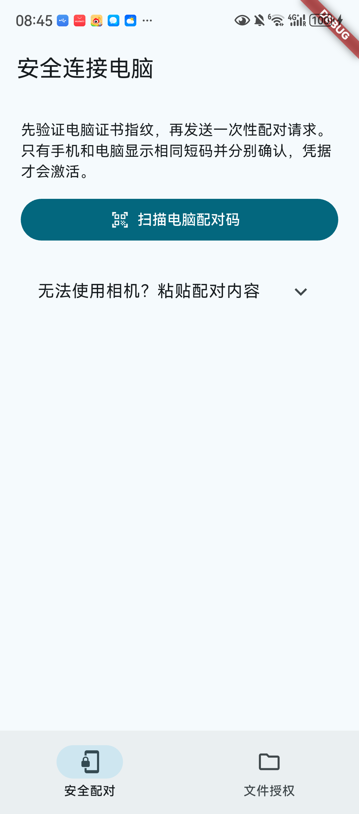
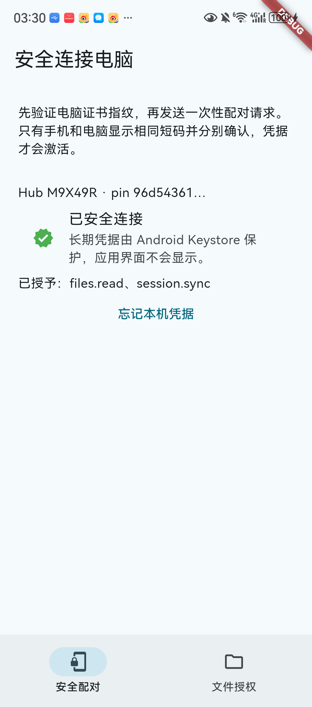
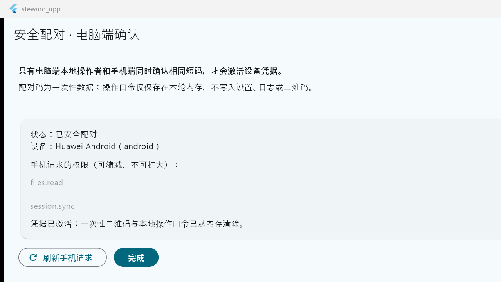
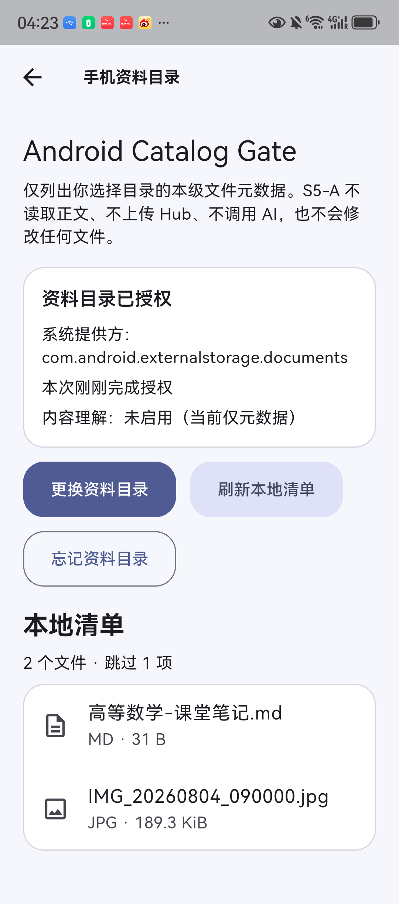
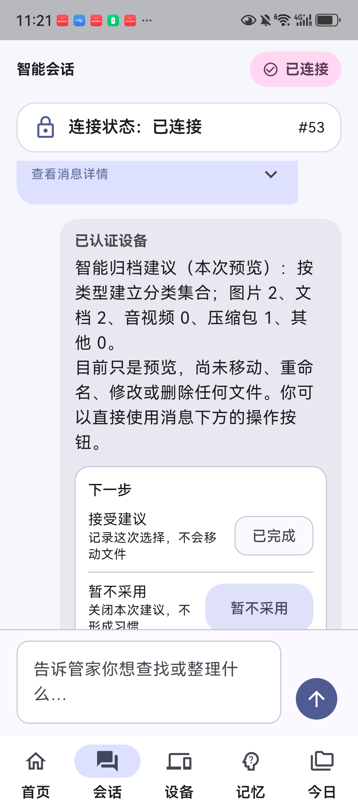
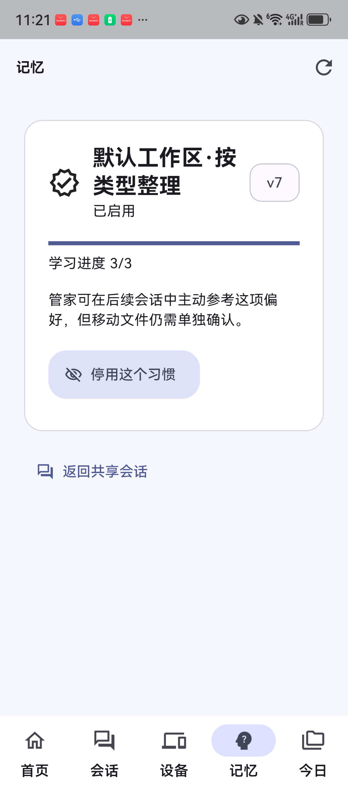

# Data Steward 安装与使用指南

> 适用版本：APP Demo 1.0.0+1 / S6-G  
> 已验证环境：Windows 11 + 华为 Android 12（API 31）  
> 文档定位：面向首次安装者、体验者和复现者。截图来自真实验收过程，当前构建的文字与布局可能有小幅优化，但操作路径一致。

Data Steward 是一个面向 Windows 与 Android 的多设备资料管理 Demo。它通过安全配对、授权目录、共享会话和 Hermes 智能体，把跨设备检索、内容理解、整理建议、确认式文件移动、资料包导出以及习惯记忆串成可演示闭环。

## 1. 先选择体验方式

- **快速查看 UI**：解压交付包，直接启动 Windows 程序；Android 安装 APK。此方式适合查看界面，但不包含本机 Hub、Hermes、模型凭据和机器绑定的 TLS 身份。
- **完整双端体验**：在源码工作区准备 Python/Flutter 运行环境，启动本机 Hub 与 Hermes，再让手机完成安全配对。跨设备会话、真实目录、记忆、OCR 投影和智能工作流都需要此方式。

> 安全边界：交付包不会携带开发者 API Key、真实资料、SQLite 数据库或 TLS 私钥。首次在新电脑完整运行时，必须在该电脑上生成新的本机身份并重新配对。

## 2. 系统要求

- Windows 11 64 位；建议使用专用网络配置的 Wi-Fi。
- Android 10 或更高版本；Demo 已在华为 Android 12 真机验证。
- 手机与电脑连接同一可信 Wi-Fi；首次调试安装也可以使用 USB。
- 完整模式需要 Git、Flutter stable、Python 3.12.x、Visual Studio 2022 的 Desktop development with C++、Android SDK/ADB。
- Hermes 在线理解需要受支持 Provider 的 API Key 与模型/endpoint ID；没有凭据时仍可体验本机安全摘要和确定性能力。

## 3. 校验并解压交付包

在交付目录打开 PowerShell。建议先校验 SHA-256，再解压：

```powershell
Get-FileHash .\DataSteward-App-Demo-*.zip -Algorithm SHA256
Expand-Archive .\DataSteward-App-Demo-*.zip -DestinationPath .\DataSteward-App-Demo
```

将结果与同目录的校验清单对照。Windows 程序必须保留整个 `windows` 目录，不能只复制 `steward_app.exe`。

## 4. Windows 快速安装

1. 打开解压后的 `windows` 目录。
2. 双击 `steward_app.exe`。
3. 若 Windows Defender SmartScreen 提示未知发布者，确认文件 SHA-256 与交付清单一致后，再选择“更多信息”与“仍要运行”。
4. 快速模式只用于查看 Flutter UI；若首页提示 Hub 离线，请按第 6 节配置完整模式。

## 5. Android 安装

### 5.1 直接安装 APK

1. 将 `android/DataSteward-Android-Demo.apk` 复制到手机。
2. 在文件管理器中点击 APK。
3. 按系统提示仅为当前文件来源开启“允许安装未知应用”。
4. 完成安装后可关闭该来源的安装权限。

### 5.2 通过 ADB 安装（可选）

开启开发者选项与 USB 调试、在手机上确认本机授权后执行：

```powershell
adb devices -l
adb install -r .\DataSteward-Android-Demo.apk
```

APK 使用训练营 Demo 签名，不是应用商店生产签名。

<!-- pagebreak -->

## 6. 在新电脑配置完整模式

以下命令均在**仓库根目录**的 PowerShell 中执行，即能够看到 `apps`、`services`、`agents` 和 `docs` 的目录。

### 6.1 创建固定 Python 环境

```powershell
py -3.12 -m venv .\services\steward_hub\.venv
& '.\services\steward_hub\.venv\Scripts\python.exe' -m pip install `
  -r '.\services\steward_hub\requirements.lock'

py -3.12 -m venv .\agents\hermes_runtime\.venv
& '.\agents\hermes_runtime\.venv\Scripts\python.exe' -m pip install `
  -r '.\agents\hermes_runtime\requirements.lock'

& '.\services\steward_hub\.venv\Scripts\python.exe' -m pip check
& '.\agents\hermes_runtime\.venv\Scripts\python.exe' -m pip check
```

依赖只安装到仓库内被忽略的 `.venv`，不要把虚拟环境复制进提交包。

### 6.2 构建 Windows Demo

完整启动脚本当前使用 Debug runner：

```powershell
Push-Location .\apps\steward_app
flutter pub get
flutter analyze
flutter test
flutter build windows --debug
Pop-Location
```

### 6.3 在本机生成 TLS 身份

先确认 Data Steward、Hub 和测试进程均未运行，然后执行：

```powershell
& '.\services\steward_hub\.venv\Scripts\python.exe' `
  '.\services\steward_hub\tool\provision_permanent_identity.py'
```

该命令在 Windows CurrentUser 的 LocalAppData Known Folder 下创建受限 DACL、DPAPI 保护的机器身份。它不会把私钥写入仓库。重复执行应返回幂等结果，不应生成第二套身份。

### 6.4 配置 Volcengine（可选）

API Key 仅放入当前 PowerShell 进程，不写入文件：

```powershell
$env:ARK_API_KEY = [System.Net.NetworkCredential]::new(
  '',
  (Read-Host '请输入 ARK_API_KEY' -AsSecureString)
).Password
$env:DATA_STEWARD_HERMES_MODEL = Read-Host '请输入 Volcengine endpoint ID（ep-...）'
```

出现输入提示后，应粘贴实际 Key 或 endpoint ID 并按 Enter；不要把示例值写进命令提示文本，不要截图或提交终端内容。

### 6.5 启动完整 Demo

先在 Windows“设置 → 网络和 Internet → Wi-Fi → 当前网络”中把网络配置为“专用”，并确保手机处于同一 Wi-Fi：

```powershell
.\apps\steward_app\tool\start_c3_windows_demo.ps1 `
  -HermesProvider volcengine `
  -HermesModel $env:DATA_STEWARD_HERMES_MODEL
```

脚本只选择唯一、活动的私网 IPv4，不会自动修改防火墙。如果电脑存在多个活动私网适配器，可显式传入当前 Wi-Fi 地址：

```powershell
.\apps\steward_app\tool\start_c3_windows_demo.ps1 `
  -PrivateIpv4 '<当前 Wi-Fi 私网 IPv4>' `
  -HermesProvider volcengine `
  -HermesModel $env:DATA_STEWARD_HERMES_MODEL
```

不要沿用前一天的 IP；先用 `Get-NetIPAddress -AddressFamily IPv4` 核对当前地址。

## 7. 首次安全配对

1. 在 Windows 的安全连接页生成二维码。
2. 手机进入“安全配对”，扫描**本轮最新**二维码。
3. 对照手机与电脑显示的 Human32 短码；只有完全一致时才继续。
4. 在电脑端确认所需权限，再在手机端确认。
5. 配对成功后短码隐藏，设备凭据保存在 Android Keystore 中；后续通常不必重新创建长期身份。



图 1　手机端安全配对入口。只扫描电脑刚生成的二维码。



图 2　配对激活后，手机显示安全连接与已授予权限。



图 3　电脑端确认设备身份与能力。截图为早期验收版，当前产品界面已优化。

> 如果出现 `protocol_integrity_error`，不要重复扫描旧二维码。返回扫码页，在电脑生成新二维码后重新核对短码。

<!-- pagebreak -->

## 8. 授权资料目录

### 8.1 Windows 目录

1. 在 Windows 资料页选择一个专用 Demo 目录，避免授权整个用户目录或系统盘。
2. 首次选择后会保存为默认工作区；重启时进行安全恢复。
3. 开启“允许 AI 理解此电脑资料”后，TXT/MD、DOCX、PPTX 与文本型 PDF 才能进入受控内容投影。
4. 加密 PDF、外链、异常压缩结构、超限内容或提示注入会 fail-closed。

### 8.2 Android 目录

1. 在手机资料页点击目录授权。
2. 使用系统文件选择器选择一个专用目录，并点击“使用此文件夹”。
3. 应用仅持久化 SAF 授权；不会申请全盘存储权限。
4. JPG/PNG OCR 必须单独开启；识别在手机端完成，原图不上传，只同步有界加密文字投影。



图 4　Android 授权目录后的清单与跳过统计。界面中的 Gate 字样仅来自验收构建。

## 9. 会话与常用示例

Windows 输入框支持 Enter 发送、Shift+Enter 换行。手机端在网络不稳定时不会循环重试；应等待网络稳定，再执行一次重连或刷新服务码。

可以直接使用自然语言，不要求背固定句式：

- “看下电脑授权目录有几个图片文件。”
- “帮我找文件名包含训练营的资料。”
- “阅读当前已授权的课程资料，列出三个最重要的复习要点。”
- “根据当前资料，安排一份今晚的复习顺序。”
- “参考我的整理习惯，整理当前资料。”
- “生成一个跨设备复习资料包。”

Hermes 可以在 allow-list 只读工具中自主选择目录清单、搜索、聚类、内容摘要和记忆上下文。涉及移动文件或导出 Markdown 时，它只生成 typed Action Card；Host 会重新校验权限、快照和参数，并等待用户确认。



图 5　共享会话中的自然语言请求、来源说明和确认式 Action Card。

## 10. 如何安全执行整理与导出

1. 先阅读建议卡片中的目标分组、文件数量、来源设备和安全边界。
2. 点击“预览”确认具体操作。
3. 只有点击“确认执行”后，系统才移动 PC 授权目录中的匹配文件，或新建一个 Markdown 资料包。
4. 手机文件不会被 PC 整理动作移动；系统不覆盖同名文件、不删除原资料。
5. 最近一次成功操作可撤销。若导出文件已被用户修改，系统保留该文件并停止撤销，避免覆盖用户编辑。

“今日资料”中的分组建议本身是虚拟视图；只有经过 Action Card 二次确认的操作才会真实改变文件。

## 11. 习惯学习与跨会话记忆

连续三次明确接受相同类型的整理建议后，系统形成候选习惯。用户启用后，普通的“整理/归档/分类资料”表达会查询真实已启用习惯并生成确认式 Action Card；不会因为记忆存在就自动移动文件。



图 6　记忆中心展示学习进度、启用状态和停用/重新启用入口。

可随时停用、遗忘或重新启用习惯。Hub 暂时不可用时，手机可以显示同一 Hub、设备和权限版本绑定的离线安全快照，但会禁用修改操作。

## 12. 重连与日常使用

- 应用会保存设备凭据、可信 Hub 身份和最后可用 endpoint；同一可信网络下优先零扫码恢复。
- WLAN 地址变化时，先等待手机和电脑网络稳定，再使用“寻找已配对电脑”。
- 自动发现不可用时，刷新一次电脑服务码并在手机重新连接；这通常只是更新会话 endpoint，不是重建长期设备身份。
- 不要连续点击重试。一次请求已经进入待确认或 outbox 后，应等待确认；仅在 UI 明确提供“重试”且网络稳定时手动重试一次。

## 13. 常见问题

### Hub 离线或找不到电脑

确认 Windows App 正在运行、两端同一 Wi-Fi、Windows 网络为“专用”，再单次刷新。校园网/访客网络可能隔离客户端，此时改用可信热点或服务码兜底。

### 消息显示“未确认”

先等待网络恢复和服务端确认。系统会保留待发消息并去重，不应连续发送相同请求。长时间无确认时，再点击一次可见的重试入口。

### 手机显示“记忆服务暂时不可用”

等待 Hub 恢复后单次刷新。离线快照只读，身份、Hub 或权限 epoch 改变时旧快照会被隔离。

### 目录数据看起来过期

在对应设备刷新目录；若授权已失效，重新选择原专用目录。手机删除文件后重新同步目录版本，电脑端会移除旧投影而不是累加重复项。

### 缺少某项权限

不要清数据。由电脑生成权限迁移二维码，重新核对短码并批准新的最小权限集合。

### 模型不可用

检查当前 PowerShell 是否仍有 Provider Key 与 endpoint ID。Key 只存在于该终端进程；关闭终端后需要重新输入。Provider 不可用时系统应给出本机确定性响应或停止本轮操作，不会无限重试。

## 14. 当前 Demo 边界

- 已覆盖 Windows 与 Android；未提供 iOS/Pad 真机版本。
- 未实现录音转写、扫描 PDF OCR、向量语义检索、手机文件移动、日历/待办写入或跨设备写入 Saga。
- Windows Release 包可独立展示 UI，但完整 Hub/Hermes 仍依赖源码工作区、固定 Python 虚拟环境和本机 TLS 身份。
- Android APK 为训练营 Demo 签名，不用于应用商店发布。
- Hermes 没有 Shell、任意文件读写或网络工具；文件变更必须通过 Host 的权限校验与用户确认。

## 15. 推荐演示流程

1. 启动完整 Windows Demo，手机零扫码恢复或完成一次安全配对。
2. 双端分别授权专用资料目录，展示双设备目录与“今日资料”。
3. 在手机发送“阅读当前已授权资料，列出三个复习要点”。
4. 发送“参考我的整理习惯，整理当前资料”，展示建议与 Action Card。
5. 预览并确认执行，再演示撤销。
6. 生成跨设备资料包，确认后导出一个 Markdown；说明来源、幂等和修改后拒绝撤销。
7. 打开记忆中心，展示已启用习惯和离线安全快照。

整个演示始终使用非敏感 fixture。结束后关闭 Windows App，确认没有遗留 Hub/Hermes 进程，并删除不再需要的 Demo 输出。
